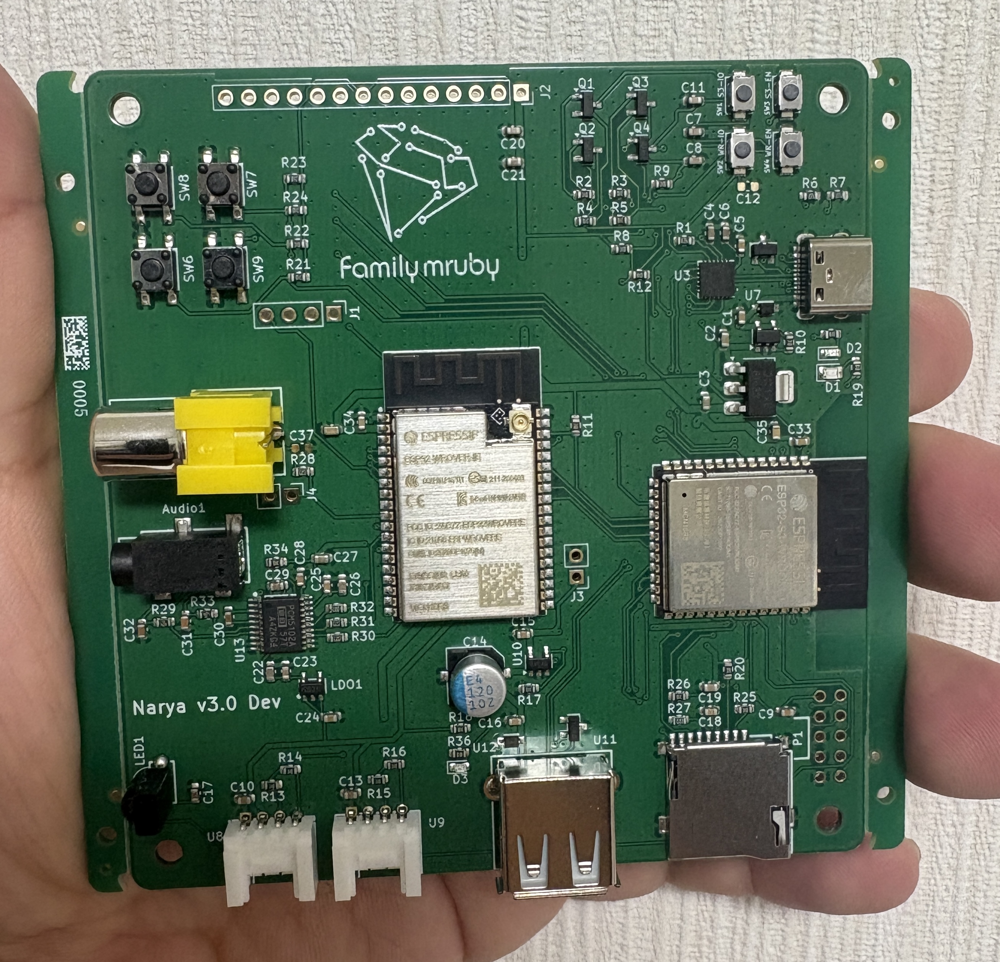

# Family mruby

[English](README.md)

## Family mruby とは

マイコン単体でmrubyの開発、実行が可能な開発プラットフォームです。オーディオ・グラフィックス機能を備え、ESP32で動作するように設計されています。

詳細については、以下のブログ記事をご覧ください:
[Family mruby OSーFreeRTOSベースのmicroRubyマルチVM構想](https://blog.silentworlds.info/family-mruby-os-freertosbesunomicrorubymarutivmgou-xiang/)

### デモ動画

[](https://www.youtube.com/watch?v=Wa_3XtLF-6U)

[YouTube](https://www.youtube.com/watch?v=Wa_3XtLF-6U)


## プロジェクトの構成

### fmrb-core

Family mrubyのコア機能を提供するライブラリです。Family mruby OS の実行環境、抽象化レイヤー、システムリソース管理機能が含まれています。
デバッグ用にLinuxでも実行可能です。


[GitHub Repository](https://github.com/family-mruby/fmruby-core)

### fmrb-audio-graphics

ESP32向けに、オーディオ再生とグラフィックス描画機能を提供するファームウェアです。画像表示、音声出力、基本的なマルチメディア処理をサポートします。

[GitHub Repository](https://github.com/family-mruby/fmruby-audio-graphics)

### narya-board

Family mrubyの開発・実行環境として使用される基板です。
KiCADの設計データが含まれています。

[GitHub Repository](https://github.com/family-mruby/narya-board)



## ドキュメント

### family-mruby-doc

Family mrubyの使い方、設計情報を含む総合ドキュメントです。
（準備中です）

[https://family-mruby.github.io](https://family-mruby.github.io)

## クイックスタート

### セットアップ

初回のみ、fmruby-core と fmruby-graphics-audio を取得します：

```bash
rake fetch
```

### ビルド

fmruby-core (ESP32-S3) と fmruby-graphics-audio (ESP32) の両方をビルドします：

```bash
rake build:esp32
```

開発・テスト用のLinuxビルド（SDL2）：

```bash
rake build:linux
```

### Dockerで試す (VNC デスクトップ)

ハードウェアやビルド環境なしで Family mruby OS を試すことができます。ビルド済みのDockerイメージにはすべてのバイナリが含まれており、VNCデスクトップとして提供されます。

```bash
docker run --rm -p 6080:6080 ghcr.io/family-mruby/fmruby-desktop:latest
```

ブラウザで http://localhost:6080/vnc.html を開くと、VNCビューア上にFamily mruby OSのデスクトップが表示されます。

macOS (Apple Silicon / Intel)、Linux、Windows (WSL2) で動作します。VNCクライアントは不要です -- noVNCによりブラウザだけで利用できます。

> 注意: VNC環境では音声は対応していません。

### ローカルビルドとDocker Composeでのテスト

ソースからビルドしてSDL2表示でテストする場合は、まずLinuxバイナリをビルドします：

```bash
rake fetch        # 初回のみ
rake build:linux
```

ビルド後、Docker Composeでシミュレーション環境を起動します：

```bash
docker compose up
```

sdl2-display、fmruby-graphics-audio、fmruby-core がLinuxシミュレーションモードで起動し、ローカルビルドしたバイナリを使用します。X11ディスプレイ転送が必要です (WSL2またはLinuxデスクトップ環境)。
