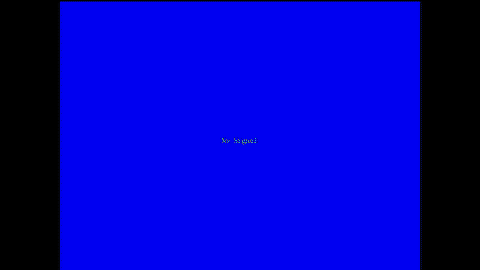
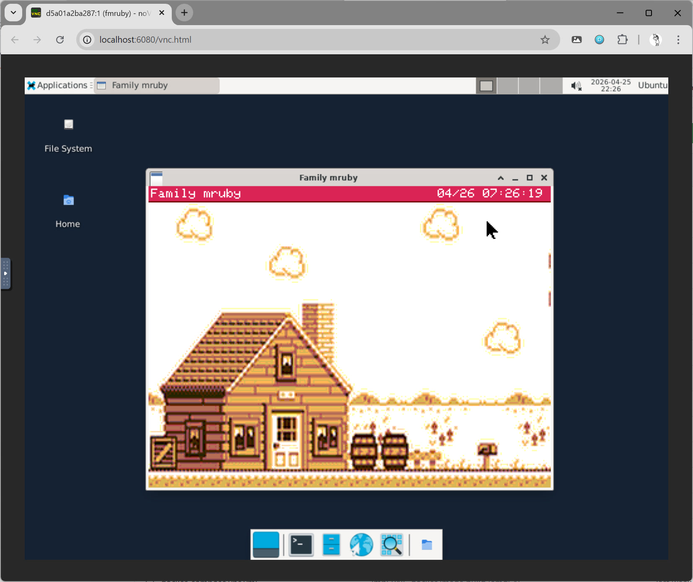
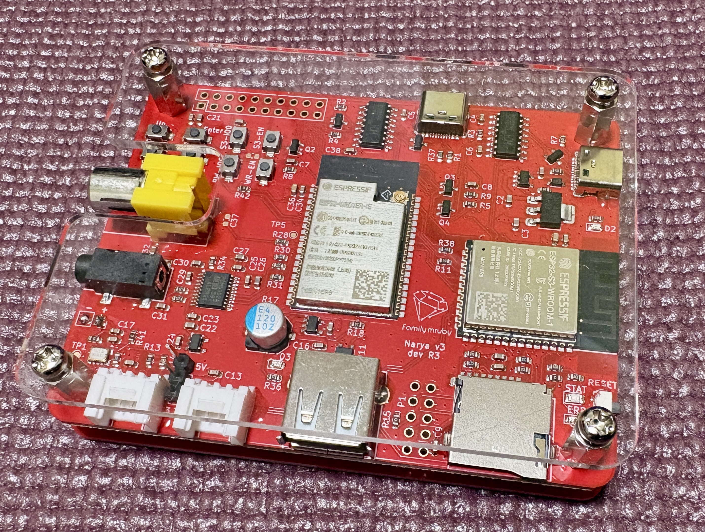

# Family mruby

[English](README.md)

## Family mruby とは

マイコン単体でmrubyの開発、実行が可能な開発プラットフォームです。オーディオ・グラフィックス機能を備え、ESP32シリーズで動作するように設計されています。

2つのハードウェア世代があります：

- **Family mruby Retro** — NARYAボード (ESP32-S3 + ESP32-WROVER の2チップ構成)。NTSC映像出力でテレビにつないで遊ぶ、レトロスタイルの構成です
- **Family mruby Modern** — ESP32-P4向けの構成。現在は M5Stack Tab5 単体で動作し、高解像度画面とタッチ操作を備えます (専用基板は開発中)

詳細については、以下のブログ記事をご覧ください:
[Family mruby OSーFreeRTOSベースのmicroRubyマルチVM構想](https://blog.silentworlds.info/family-mruby-os-freertosbesunomicrorubymarutivmgou-xiang/)

### デモ動画

[](https://www.youtube.com/watch?v=9vkRaOoxJJI)

[LongバージョンはYouTubeで](https://www.youtube.com/watch?v=9vkRaOoxJJI)

## ドキュメント

### family-mruby-doc

Family mrubyの使い方、設計情報のドキュメントです。

[https://family-mruby.github.io/ja](https://family-mruby.github.io/ja)

## 動作を簡単に試す方法

### Web Installer で実機に書き込む

実機 (NARYAボード / M5Stack Tab5) を持っている場合は、ブラウザだけでファームウェアを書き込めます：

[https://family-mruby.github.io/family-mruby-installer/](https://family-mruby.github.io/family-mruby-installer/)

WebSerial を使うため、対応ブラウザは Chrome / Edge / Opera (デスクトップ) です。

### VNC デスクトップをDockerで動かして試す




ハードウェアやビルド環境なしで Family mruby OS を試すことができます。ビルド済みのDockerイメージにはすべてのバイナリが含まれており、VNCデスクトップとして提供されます。

```bash
docker run --rm -p 6080:6080 ghcr.io/family-mruby/fmruby-desktop:latest
```

ブラウザで http://localhost:6080/vnc.html を開くと、VNCビューア上にFamily mruby OSのデスクトップが表示されます。

Linux、Windows (WSL2) での動作を確認しています。VNCクライアントは不要です -- noVNCによりブラウザだけで利用できます。
ARM64のイメージも準備しているので、Macでも動作すると思いますが、未検証です。

> 注意: VNC環境では音声は対応していません。

## プロジェクトの構成

### fmruby-core

Family mrubyのコア機能を提供するファームウェアです。Family mruby OS の実行環境、抽象化レイヤー、システムリソース管理機能が含まれています。
Retro (ESP32-S3) と Modern (ESP32-P4) の両方のターゲットを持ち、デバッグ用にLinuxでも実行可能です。

[GitHub Repository](https://github.com/family-mruby/fmruby-core)

### fmruby-graphics-audio

Retro (NARYAボード) のサブマイコン (ESP32-WROVER) 向けファームウェアです。NTSC映像出力とI2S音声出力を担当します。
Modern は1チップ構成のため、このファームウェアは使用しません。

[GitHub Repository](https://github.com/family-mruby/fmruby-graphics-audio)

### narya-board

Family mruby Retro の開発・実行環境として使用される基板です。
KiCADの設計データが含まれています。Modern は市販の M5Stack Tab5 で動作します。

[GitHub Repository](https://github.com/family-mruby/narya-board)



## 開発方法

### 前提パッケージ (Ubuntu / Debian)

利用する機能に応じて、必要なパッケージをインストールします：

```bash
# 基本ツール (rake fetch / build:linux / build:esp32 で必要)
sudo apt install git ruby-rake ruby-dev build-essential curl

# ファームウェア本体は ESP-IDF のコンテナ内でビルドするため、
# Docker が必要です。https://docs.docker.com/engine/install/
sudo apt install docker.io   # Docker Engine / Docker Desktop でも可

# エディタの型データベース生成のため必要
gem install rbs

# rake build:tools (fmrb-audio-tools) を使う場合
sudo apt install cmake pkg-config libsdl2-dev
```

詳細については [fmruby-core/README.md](https://github.com/family-mruby/fmruby-core/blob/main/README.md#spinel-aot-compiler) を参照してください。

### セットアップ

初回のみ、`.repos` に記載のリポジトリ (fmruby-core / fmruby-graphics-audio / fmrb-audio-tools) を取得します：

```bash
rake fetch
```

### ビルド

Retro向け: fmruby-core (ESP32-S3) と fmruby-graphics-audio (ESP32) の両方をビルドします：

```bash
rake build:esp32
```

Modern (M5Stack Tab5) 向け: fmruby-core のみをビルドします (1チップ構成のため fmruby-graphics-audio は不要)。ターゲットはコマンドラインで指定するか、`fmruby-core/.env` の `FMRB_HW_TARGET` を編集します (コマンドライン側が優先されます)：

```bash
cd fmruby-core
FMRB_HW_TARGET=TAB5 rake build:esp32      # M5Stack Tab5
FMRB_HW_TARGET=NARYAv4 rake build:esp32   # NARYA v4 試作機 (ESP32-P4-Nano + LT8912B HDMI)
```

Tab5 と NARYA v4 は同じ ESP32-P4 ですが、チップリビジョンの指定が異なるためバイナリに互換性はありません。

ターゲットを切り替えるとチップが変わるので、直前に別のチップでビルドしていた場合は先に `rake clean_all` を実行してください。

開発・テスト用のLinuxビルド（SDL2）：

```bash
rake build:linux
```

### 実機レスでのテスト

ソースからビルドしてSDL2表示でテストする場合は、まずLinuxバイナリをビルドします：

```bash
rake fetch        # 初回のみ
rake build:linux
```

ビルド後、使用する環境を `.env` で選択し、Docker Composeでシミュレーション環境を起動します：

```bash
cp .env.example .env    # 初回のみ。WSL (デフォルト) か Ubuntu かを .env で選択
docker compose up
```

`.env` では `COMPOSE_FILE` によってオーバーライドファイルを切り替えます：

- `docker-compose.yml:docker-compose.wsl.yml` — WSL2 + WSLg（デフォルト）
- `docker-compose.yml:docker-compose.ubuntu.yml` — Ubuntuネイティブデスクトップ（`XAUTHORITY` と `/run/user/$UID` を使用）

sdl2-display、fmruby-graphics-audio、fmruby-core がLinuxシミュレーションモードで起動し、ローカルビルドしたバイナリを使用します。

## 注意事項

- 開発中のため、起動しないアプリケーションや、想定しないエラーが発生する可能性があります。
- あくまでホビー用途を想定しており、安全性が求められる用途での使用は想定していません。
- ネットワーク機能（WiFi / BLE）にはアクセス制限がありません。リモートデスクトップ（HTTP / WebSocket）は同じネットワーク上の誰からの接続も受け付け、画面の閲覧とキーボード・マウス操作ができます。BLE のデバッグ機能もペアリングや暗号化を行っておらず、電波の届く範囲から接続してアプリケーションの状態の閲覧や起動・停止ができます。WiFi の接続情報は端末上に平文で保存されます。信頼できる環境でのみ、自己責任でご利用ください。インターネットに直接公開しないでください。
- 本ソフトウェアは GNU General Public License v3 の下で配布されています。無保証（NO WARRANTY）で提供されます。詳細は [LICENSE](LICENSE) をご覧ください。
