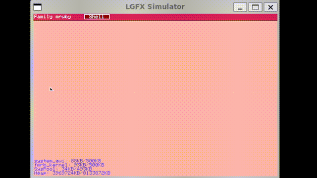
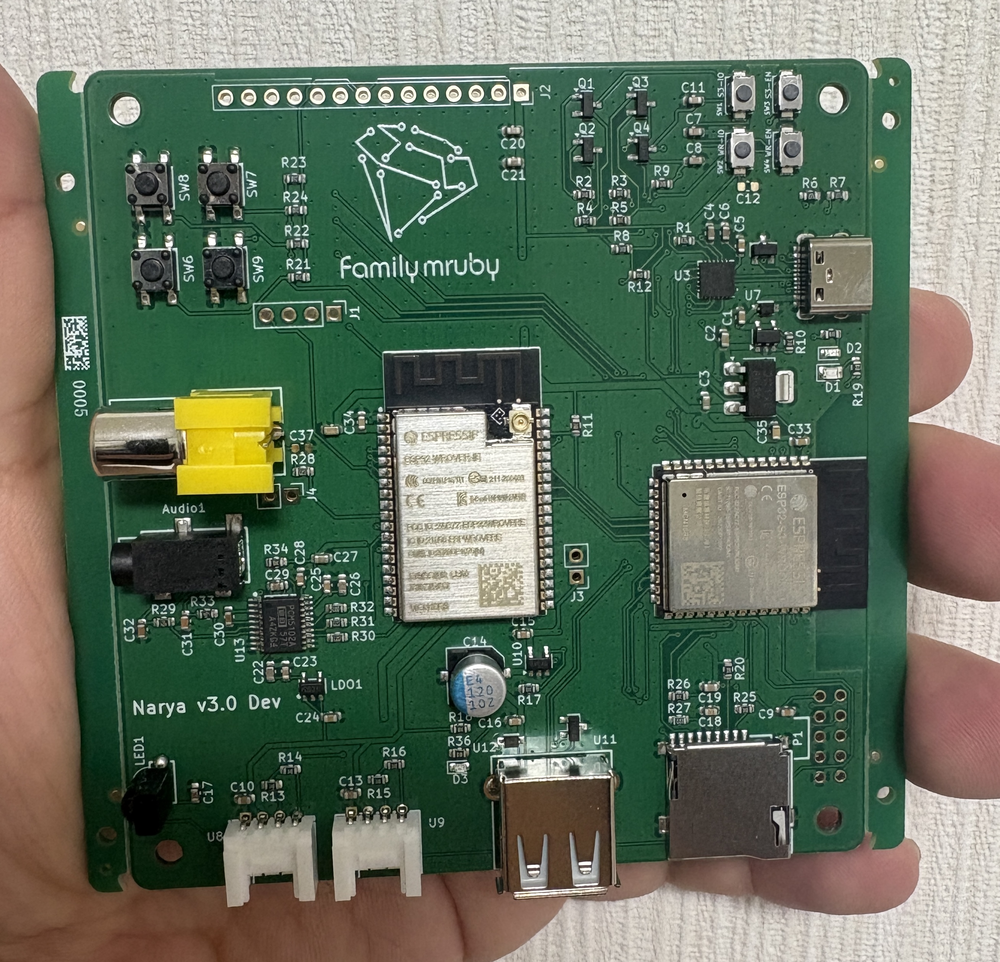

# Family mruby

[日本語](README.ja.md)

## What is Family mruby

A development platform that enables mruby development and execution directly on microcontrollers. It features audio and graphics capabilities and is designed to run on ESP32.

For more details, please refer to the following blog post :
[Family mruby OS - FreeRTOS-based microRuby Multi-VM Architecture](https://blog.silentworlds.info/family-mruby-os-freertosbesunomicrorubymarutivmgou-xiang-2/)

### Demo Video

[](https://www.youtube.com/watch?v=Wa_3XtLF-6U)

[YouTube](https://www.youtube.com/watch?v=Wa_3XtLF-6U)

## Project Components

### fmrb-core

A library that provides the core functionality of Family mruby. It includes the Family mruby OS runtime environment, abstraction layer, and system resource management features.
It can also run on Linux for debugging purposes.


[GitHub Repository](https://github.com/family-mruby/fmruby-core)

### fmrb-audio-graphics

Firmware for ESP32 that provides audio playback and graphics rendering capabilities. It supports image display, audio output, and basic multimedia processing.

[GitHub Repository](https://github.com/family-mruby/fmruby-audio-graphics)

### narya-board

A circuit board used as the development and execution environment for Family mruby.
Contains KiCAD design data.

[GitHub Repository](https://github.com/family-mruby/narya-board)



## Documentation

### family-mruby-doc

Comprehensive documentation including usage instructions and design information for Family mruby.
(Under preparation)

[https://family-mruby.github.io](https://family-mruby.github.io)

## Quick Start

### Setup

First, initialize git submodules:

```bash
git submodule update --init --recursive
```

### Building

Build both fmruby-core (ESP32-S3) and fmruby-graphics-audio (ESP32):

```bash
# Build fmruby-core for ESP32-S3
cd fmruby-core && rake build:esp32

# Build fmruby-graphics-audio for ESP32
cd fmruby-graphics-audio && rake build:esp32
```

For development and testing on Linux (SDL2):

```bash
# Build Linux simulation version
cd fmruby-core && rake build:linux
cd fmruby-graphics-audio && rake build:linux
```

### Testing with Docker Compose

You can test the system integration using Docker Compose:

```bash
docker compose up
```

This will launch both fmruby-core and fmruby-graphics-audio in Linux simulation mode, allowing you to test the complete system without hardware.


