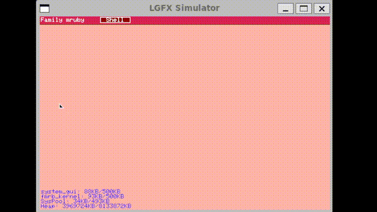

# Family mruby

[日本語](README.ja.md)

## What is Family mruby

A development platform that enables mruby development and execution directly on microcontrollers. It features audio and graphics capabilities and is designed to run on ESP32.

For more details, please refer to the following blog post :
[Family mruby OS - FreeRTOS-based microRuby Multi-VM Architecture](https://blog.silentworlds.info/family-mruby-os-freertosbesunomicrorubymarutivmgou-xiang-2/)

### Demo Video

[](https://www.youtube.com/watch?v=Wa_3XtLF-6U)

[YouTube](https://www.youtube.com/watch?v=Wa_3XtLF-6U)

## Project Components

### fmrb-core

A library that provides the core functionality of Family mruby. It includes the Family mruby OS runtime environment, abstraction layer, and system resource management features.
It can also run on Linux for debugging purposes.


[GitHub Repository](https://github.com/family-mruby/fmruby-core)

### fmrb-audio-graphics

Firmware for ESP32 that provides audio playback and graphics rendering capabilities. It supports image display, audio output, and basic multimedia processing.

[GitHub Repository](https://github.com/family-mruby/fmruby-audio-graphics)

### narya-board

A circuit board used as the development and execution environment for Family mruby.
Contains KiCAD design data.

[GitHub Repository](https://github.com/family-mruby/narya-board)


## Documentation

### family-mruby-doc

Comprehensive documentation including usage instructions and design information for Family mruby.
(Under preparation)

[https://family-mruby.github.io](https://family-mruby.github.io)

## Quick Start

### Setup

First time only, fetch fmruby-core and fmruby-graphics-audio :

```bash
rake fetch
```

### Building

Build both fmruby-core (ESP32-S3) and fmruby-graphics-audio (ESP32):

```bash
rake build:esp32
```

For development and testing on Linux (SDL2):

```bash
rake build:linux
```

### Try with Docker (VNC Desktop)

You can try Family mruby OS without any hardware or build environment. A pre-built Docker image provides a VNC desktop with all binaries included.

```bash
docker run --rm -p 6080:6080 ghcr.io/family-mruby/fmruby-desktop:latest
```

Then open http://localhost:6080/vnc.html in your browser. The Family mruby OS desktop will appear in the VNC viewer.

This works on macOS (Apple Silicon / Intel), Linux, and Windows (WSL2). No VNC client is required -- everything runs in the browser via noVNC.

> Note: Audio is not supported in the VNC environment.

### Building and Testing Locally with Docker Compose

If you want to build from source and test with SDL2 display, first build the Linux binaries:

```bash
rake fetch        # First time only
rake build:linux
```

Then set up your environment and launch the simulation with Docker Compose:

```bash
cp .env.example .env    # First time only. Select WSL (default) or Ubuntu inside .env
docker compose up
```

`.env` selects which override file to apply via `COMPOSE_FILE`:

- `docker-compose.yml:docker-compose.wsl.yml` — WSL2 + WSLg (default)
- `docker-compose.yml:docker-compose.ubuntu.yml` — native Ubuntu desktop (uses `XAUTHORITY` and `/run/user/$UID`)

This will launch sdl2-display, fmruby-graphics-audio, and fmruby-core in Linux simulation mode using the locally built binaries. Requires X11 display forwarding (WSL2 or Linux desktop).
